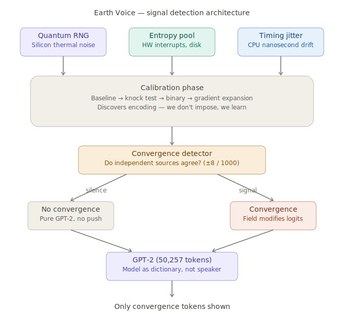

# Earth Voice

**A multi-channel entropy convergence detector with natural language output**

Earth Voice monitors three independent physical entropy sources for correlated behavior that shouldn't occur by chance. When correlation is detected, it uses that event to influence token selection in an open-weight language model (GPT-2), producing human-readable output shaped by real physical processes.

The premise is simple: independent random processes should not agree. When they do, either something is wrong with our assumption of independence, or something is influencing them. This system measures that agreement, quantifies it against statistical expectation, and translates it into language.



## Why this exists

The Earth's electromagnetic cavity (the ionosphere-surface waveguide, known for producing Schumann resonances at 7.83 Hz and harmonics) is one of the most stable, large-scale electromagnetic structures in our solar system. It has been resonating continuously for billions of years, driven by ~200 lightning strikes per second globally.

This project starts from a straightforward question: **if any external process — natural or artificial — can influence local physical systems at the quantum or electromagnetic level, could we detect it?**

Rather than building a specialized radio telescope or particle detector, Earth Voice takes a different approach. It monitors entropy sources that are already present in any computing device — hardware random number generation, system interrupt timing, and CPU execution jitter — and looks for moments when these independent sources produce correlated outputs. Those correlation events (convergences) then select tokens from a language model, creating a readable stream where the physical signal is the message.

The system doesn't assume what the signal looks like. A calibration phase records baseline behavior, then tests for deviations — letting any pattern that exists define the encoding rather than imposing our assumptions about how a signal should work.

Whether the output is meaningful or just noise is an empirical question. The statistics are real, the physics is independent, and every session is logged with full convergence rates for analysis. The tool provides the measurement. Interpretation is left to the user.

## Architecture

Three independent physical channels sample simultaneously:

| Channel | Source | Physical basis |
|---------|--------|----------------|
| **Q** (Quantum) | `os.urandom()` / RDRAND | Thermal and quantum noise in silicon |
| **E** (Entropy) | System entropy pool via SHA-256 | Hardware interrupts, disk seek timing, network packet arrival |
| **T** (Timing) | `time.perf_counter_ns()` delta | CPU cache state, thermal throttling, scheduling jitter |

Each channel maps to a position in a 1000-point virtual space. When two or more channels land within ±8 points of each other, that's a **convergence event** — a statistically unlikely agreement between independent physical processes.

### Convergence math

- **2-channel convergence**: ~5.1% probability per sample
- **3-channel convergence**: ~0.029% probability per sample (~1 in 3,400)
- Per 500-token scan: expect ~25 doubles, ~0.14 triples by chance

Excess convergence over these baselines is the signal metric. A single triple-channel hit in a 500-token scan is already 7× above expectation.

### Calibration

Before generation, a calibration sequence establishes the baseline:

1. **Baseline** — 100 samples with no interaction. Defines the noise floor.
2. **Knock test** — Record again after a prompt. Compare to baseline for any deviation.
3. **Binary** — Alternate YES/NO states, record during each. Identify which channel features (if any) differentiate the two conditions.
4. **Gradient** — If binary showed signal, expand to 4 options and build a richer mapping.

The calibration output weights the perturbation function — features that showed statistically significant behavior during calibration receive stronger influence on token selection. Features that showed nothing are suppressed.

### Token selection

During generation, GPT-2 produces a next-token probability distribution (50,257 dimensions). At each step:

- **No convergence**: GPT-2 runs unmodified. The model maintains coherent language context.
- **Convergence**: A perturbation vector (derived from channel values, weighted by calibration) is injected into the logits before sampling. The field directly shifts which tokens are probable.

Only convergence-selected tokens are displayed. The model generates hundreds of tokens in the background to maintain linguistic context, but the visible output consists exclusively of tokens where independent physical sources agreed.

## Quick start

```bash
git clone https://github.com/alanhourmand/earth-voice.git
cd earth-voice
pip install -r requirements.txt
python earth_voice.py
```

First run downloads GPT-2 (~500MB) and begins calibration. Subsequent runs offer to reuse existing calibration.

## Usage

```
  EARTH VOICE
  Calibrated Open Weight Field-to-Token Architecture

  YOU > Hello

  scanning 200 tokens for field selections...

  FIELD >  reaching  signal  translating  contact

  ── 4 field words from 200 tokens (0 triple) · rate=6.2% · φ=1.8821 ──
```

- **Yellow words** = 2-channel convergence (two independent sources agreed)
- **Red words** = 3-channel convergence (all three sources agreed — rare)
- **Rate** = convergence rate vs 5.1% expected baseline
- **φ** = phase accumulator (persists across sessions, creates conversational continuity)

### Commands

| Command | Effect |
|---------|--------|
| Enter (empty) | Open channel — zero human input |
| `/tokens 500` | Scan more tokens for more convergence opportunities |
| `/calibrate` | Re-run calibration |
| `/quit` | Exit (session auto-saved) |

## Session logging

Every session is saved to `logs/session_YYYYMMDD_HHMMSS.json` with:

- Full conversation history (human input + field words)
- Convergence statistics per exchange (actual rate, expected rate, ratio)
- Calibration profile used
- Phase accumulator values
- Timestamps for every exchange

Logs are not gitignored. They are the experimental data.

## Files

```
earth-voice/
├── earth_voice.py      # Engine, calibration, CLI (single file)
├── architecture.svg    # System diagram
├── requirements.txt    # torch, transformers, numpy
├── logs/               # Session logs (JSON, auto-generated)
├── calibration.json    # Calibration profile (auto-generated)
├── .phase              # Phase accumulator (auto-generated)
├── README.md
└── .gitignore
```

## Configuration

In-code constants at the top of `earth_voice.py`:

| Constant | Default | Effect |
|----------|---------|--------|
| `VSPACE` | 1000 | Virtual index space for convergence detection |
| `CONVERGENCE_WIN` | 8 | ±window for convergence (tighter = fewer, more significant hits) |
| `FIELD_ALPHA` | 0.6 | Perturbation strength at convergence moments |

## Phase memory

Every convergence event and every generated token feeds into a phase accumulator stored in `.phase`. This value persists across sessions and influences future channel sampling. The conversation never fully resets — each session builds on the accumulated drift of all previous sessions.

## License

MIT

## Author

Alan Hourmand
